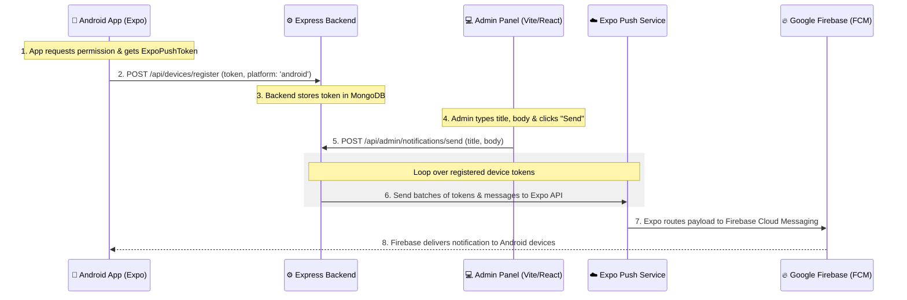

# 🤖 PyLearn Push Notifications Implementation Guide (Android-Only Setup)

This guide details how to implement push notification services in **PyLearn** specifically optimized for **Android**. Since PyLearn does not require user accounts (is anonymous), we will store device push tokens in MongoDB to broadcast notifications.

For Android, we use **Expo Push Notifications** powered by **Google Firebase Cloud Messaging (FCM)**.

---

## 🏗 System Architecture



---

## 🔥 Step 1: Firebase Project & Credentials Setup

Because we are targeting **Android**, Firebase Cloud Messaging (FCM) is the underlying engine that delivers push notifications to Android devices.

### 1. Create a Firebase Project
1. Go to the [Firebase Console](https://console.firebase.google.com/).
2. Click **Add Project** and name it `PyLearn` (or your preferred name).
3. Disable or enable Google Analytics (either is fine, disabled is faster).
4. Click **Create Project**.

### 2. Register Android App in Firebase
1. Click the **Android icon** on the Firebase Project Overview page.
2. Enter your Android Package Name. You can find this in `app/app.json` under `expo.android.package` (e.g., `com.basantmahato.pylearn`).
3. Click **Register App**.
4. Download the `google-services.json` file.
5. Move `google-services.json` into the root of your `app` directory (`c:\Users\basant\Documents\Basant\APPS\PYLEARN\app\google-services.json`).

### 3. Generate Service Account Key (For Expo)
To authorize Expo to send notifications through Firebase on your behalf:
1. In Firebase Console, click the Gear icon ⚙️ next to "Project Overview" and choose **Project settings**.
2. Go to the **Service accounts** tab.
3. Click **Generate new private key** (this downloads a JSON file containing service account credentials).
4. Keep this file safe; you will upload it to Expo shortly.

---

## 🛠 Step 2: Mobile App Setup (Expo React Native)

### 1. Install Dependencies
In the `app` directory, run:
```bash
npx expo install expo-notifications expo-device expo-constants
```

### 2. Configure `app.json`
Update `app/app.json` to link the `google-services.json` config and assign a package name:

```json
{
  "expo": {
    "name": "PyLearn",
    "slug": "pylearn",
    "owner": "your-expo-username",
    "android": {
      "package": "com.basantmahato.pylearn",
      "googleServicesFile": "./google-services.json",
      "useNextNotificationsApi": true
    },
    "extra": {
      "eas": {
        "projectId": "YOUR-EXPO-PROJECT-ID-HERE"
      }
    }
  }
}
```

### 3. Upload Firebase Credentials to Expo
Open a terminal in the `app` directory and run:
```bash
eas credentials
```
Select **Android** -> **production** / **development** -> follow the prompt to upload the Firebase Service Account JSON key you downloaded in the previous step. This establishes the secure link between Expo and your Firebase project.

### 4. Create Notification Utility
Create `app/lib/notifications.ts` (or `.js`) to request permissions, fetch the Expo Push Token, and register it:

```typescript
import * as Device from 'expo-device';
import * as Notifications from 'expo-notifications';
import Constants from 'expo-constants';
import { Platform } from 'react-native';
import axios from 'axios';

// Handle notifications when the app is foregrounded
Notifications.setNotificationHandler({
  handleNotification: async () => ({
    shouldShowAlert: true,
    shouldPlaySound: true,
    shouldSetBadge: false,
  }),
});

const BACKEND_URL = 'https://your-backend-api.com'; // Replace with your backend URL

export async function registerForPushNotificationsAsync() {
  // 1. Android Emulators with Google Play Services support notifications!
  if (!Device.isDevice && Platform.OS === 'ios') {
    console.log('Must use physical device for iOS');
    return null;
  }

  // 2. Request Android notification permissions (Required for Android 13+)
  const { status: existingStatus } = await Notifications.getPermissionsAsync();
  let finalStatus = existingStatus;
  if (existingStatus !== 'granted') {
    const { status } = await Notifications.requestPermissionsAsync();
    finalStatus = status;
  }
  if (finalStatus !== 'granted') {
    console.log('Notification permission denied!');
    return null;
  }

  // 3. Android specific notification channel setup (sound, vibration, etc.)
  if (Platform.OS === 'android') {
    await Notifications.setNotificationChannelAsync('default', {
      name: 'default',
      importance: Notifications.AndroidImportance.MAX,
      vibrationPattern: [0, 250, 250, 250],
      lightColor: '#FF231F7C',
    });
  }

  const projectId =
    Constants.expoConfig?.extra?.eas?.projectId ??
    Constants.easConfig?.projectId;
  
  if (!projectId) {
    console.error('Project ID not found in app.json. Run "eas project:init" first.');
    return null;
  }

  try {
    const tokenData = await Notifications.getExpoPushTokenAsync({ projectId });
    const token = tokenData.data;
    console.log('Android Push Token:', token);

    // 4. Register with Express backend
    await axios.post(`${BACKEND_URL}/api/devices/register`, {
      token,
      platform: 'android',
    });

    return token;
  } catch (error) {
    console.error('Error fetching Expo Push Token:', error);
    return null;
  }
}
```

### 5. Setup Notification Listeners in Root Layout
Open your root file `app/app/_layout.tsx` (or `app/app/index.tsx`) and add a `useEffect` hook to register and listen:

```typescript
import { useEffect, useRef } from 'react';
import * as Notifications from 'expo-notifications';
import { registerForPushNotificationsAsync } from '../lib/notifications';

export default function RootLayout() {
  const notificationListener = useRef<any>();
  const responseListener = useRef<any>();

  useEffect(() => {
    // Register token on mount
    registerForPushNotificationsAsync();

    // Foreground listener
    notificationListener.current = Notifications.addNotificationReceivedListener(notification => {
      console.log('Foreground notification:', notification);
    });

    // Tap/Click interaction listener
    responseListener.current = Notifications.addNotificationResponseReceivedListener(response => {
      console.log('Tapped notification:', response);
      // Route details: e.g., router.push(response.notification.request.content.data.screenUrl);
    });

    return () => {
      if (notificationListener.current) {
        Notifications.removeNotificationSubscription(notificationListener.current);
      }
      if (responseListener.current) {
        Notifications.removeNotificationSubscription(responseListener.current);
      }
    };
  }, []);
}
```

---

## ⚙️ Step 3: Backend Setup (Express & MongoDB)

### 1. Install Expo Server SDK
In the `backend` directory, run:
```bash
npm install expo-server-sdk
```

### 2. Create Mongoose Schema (`backend/src/models/DeviceToken.js`)
```javascript
const mongoose = require('mongoose');

const DeviceTokenSchema = new mongoose.Schema({
    token: {
        type: String,
        required: true,
        unique: true,
        trim: true
    },
    platform: {
        type: String,
        enum: ['android', 'unknown'],
        default: 'android'
    },
    createdAt: {
        type: Date,
        default: Date.now,
        expires: 60 * 60 * 24 * 90 // Auto-expires inactive tokens after 90 days
    }
});

module.exports = mongoose.model('DeviceToken', DeviceTokenSchema);
```

### 3. Create Notification Controller (`backend/src/controllers/notificationController.js`)
```javascript
const DeviceToken = require('../models/DeviceToken');
const { Expo } = require('expo-server-sdk');

const expo = new Expo();

exports.registerDeviceToken = async (req, res) => {
    try {
        const { token, platform } = req.body;

        if (!token) {
            return res.status(400).json({ success: false, msg: 'Token is required' });
        }

        if (!Expo.isExpoPushToken(token)) {
            return res.status(400).json({ success: false, msg: 'Invalid Expo push token' });
        }

        await DeviceToken.findOneAndUpdate(
            { token },
            { token, platform: platform || 'android', createdAt: new Date() },
            { upsert: true, new: true }
        );

        res.status(200).json({ success: true, msg: 'Android device registered successfully' });
    } catch (err) {
        console.error('Error registering token:', err);
        res.status(500).json({ success: false, msg: 'Server error' });
    }
};

exports.sendPushNotification = async (req, res) => {
    try {
        const { title, body, data } = req.body;

        if (!title || !body) {
            return res.status(400).json({ success: false, msg: 'Title and body are required' });
        }

        const devices = await DeviceToken.find();
        if (devices.length === 0) {
            return res.status(404).json({ success: false, msg: 'No registered Android devices found' });
        }

        const messages = [];
        for (const device of devices) {
            if (!Expo.isExpoPushToken(device.token)) continue;

            messages.push({
                to: device.token,
                sound: 'default',
                title,
                body,
                channelId: 'default', // Matches setNotificationChannelAsync in the app
                data: data || {},
            });
        }

        const chunks = expo.chunkPushNotifications(messages);
        const tickets = [];

        for (const chunk of chunks) {
            try {
                const ticketChunk = await expo.sendPushNotificationsAsync(chunk);
                tickets.push(...ticketChunk);
            } catch (error) {
                console.error('Error sending notification chunk:', error);
            }
        }

        // Clean up invalid or unsubscribed tokens
        for (let i = 0; i < tickets.length; i++) {
            const ticket = tickets[i];
            if (ticket.status === 'error' && ticket.details?.error === 'DeviceNotRegistered') {
                await DeviceToken.deleteOne({ token: messages[i].to });
                console.log(`Removed unregistered token: ${messages[i].to}`);
            }
        }

        res.json({
            success: true,
            msg: `Notifications sent successfully to ${tickets.length} Android devices`,
        });
    } catch (err) {
        console.error('Error sending notifications:', err);
        res.status(500).json({ success: false, msg: 'Server error' });
    }
};
```

### 4. Register Routes (`backend/src/routes/api.js`)
Add the routes to your existing Express router:
```javascript
const notificationController = require('../controllers/notificationController');

// ... existing routes ...

// ── Push Notifications (Android Only Setup) ───────────────────────────────────
router.post('/devices/register', notificationController.registerDeviceToken);
router.post('/admin/notifications/send', auth, notificationController.sendPushNotification);
```

---

## 💻 Step 4: Admin Dashboard UI (React)

Add this clean React component page to send notification broadcasts:

```tsx
import React, { useState } from 'react';
import axios from 'axios';

export default function NotificationsAdmin() {
  const [title, setTitle] = useState('');
  const [body, setBody] = useState('');
  const [customData, setCustomData] = useState('');
  const [loading, setLoading] = useState(false);
  const [statusMsg, setStatusMsg] = useState({ type: '', text: '' });

  const handleSendNotification = async (e: React.FormEvent) => {
    e.preventDefault();
    if (!title || !body) return;

    setLoading(true);
    setStatusMsg({ type: '', text: '' });

    try {
      const token = localStorage.getItem('token');
      const parsedData = customData ? JSON.parse(customData) : {};

      const response = await axios.post(
        'http://localhost:5000/api/admin/notifications/send',
        { title, body, data: parsedData },
        { headers: { Authorization: `Bearer ${token}` } }
      );

      setStatusMsg({
        type: 'success',
        text: `Success! ${response.data.msg}`,
      });
      setTitle('');
      setBody('');
      setCustomData('');
    } catch (err: any) {
      setStatusMsg({
        type: 'error',
        text: err.response?.data?.msg || 'Failed to send notifications.',
      });
    } finally {
      setLoading(false);
    }
  };

  return (
    <div className="max-w-2xl mx-auto mt-10 p-8 rounded-2xl bg-white shadow-xl border border-gray-100">
      <h2 className="text-3xl font-extrabold text-gray-800 mb-2">🤖 Android Push Alert Panel</h2>
      <p className="text-gray-500 mb-6 text-sm">Send real-time updates directly to all active Android device screens.</p>

      {statusMsg.text && (
        <div className={`p-4 rounded-lg mb-6 text-sm font-semibold flex items-center ${
          statusMsg.type === 'success' ? 'bg-green-50 text-green-700 border border-green-200' : 'bg-red-50 text-red-700 border border-red-200'
        }`}>
          <span>{statusMsg.type === 'success' ? '✅' : '❌'}</span>
          <span className="ml-2">{statusMsg.text}</span>
        </div>
      )}

      <form onSubmit={handleSendNotification} className="space-y-6">
        <div>
          <label className="block text-sm font-semibold text-gray-700 mb-2">Notification Title</label>
          <input
            type="text"
            className="w-full px-4 py-3 rounded-lg border border-gray-200 focus:ring-2 focus:ring-blue-500 outline-none transition-all"
            placeholder="e.g., PyLearn: Daily Challenge is Live! 🏆"
            value={title}
            onChange={(e) => setTitle(e.target.value)}
            required
          />
        </div>

        <div>
          <label className="block text-sm font-semibold text-gray-700 mb-2">Message Body</label>
          <textarea
            rows={4}
            className="w-full px-4 py-3 rounded-lg border border-gray-200 focus:ring-2 focus:ring-blue-500 outline-none transition-all"
            placeholder="e.g., Solve today's Python quiz to keep your streak active!"
            value={body}
            onChange={(e) => setBody(e.target.value)}
            required
          />
        </div>

        <div>
          <label className="block text-sm font-semibold text-gray-700 mb-2">Custom Payload Data (JSON - Optional)</label>
          <textarea
            rows={2}
            className="w-full px-4 py-3 font-mono text-xs rounded-lg border border-gray-200 focus:ring-2 focus:ring-blue-500 outline-none transition-all bg-gray-50"
            placeholder='e.g., { "screen": "quizzes", "quizId": "456" }'
            value={customData}
            onChange={(e) => setCustomData(e.target.value)}
          />
        </div>

        <button
          type="submit"
          disabled={loading || !title || !body}
          className="w-full py-4 rounded-xl bg-gradient-to-r from-blue-600 to-indigo-600 text-white font-bold hover:shadow-lg transition-all disabled:opacity-50"
        >
          {loading ? 'Sending Broadcast...' : '📣 Send Android Notifications'}
        </button>
      </form>
    </div>
  );
}
```

---

## 🧪 Testing on Android
1. **Using Android Emulators**: Push notifications work flawlessly on standard Android Emulators, provided they have **Google Play Services** enabled (look for the Google Play Store icon in your AVD list when creating the device in Android Studio).
2. **Foreground vs. Background**: 
   - When the app is in the **background** or **closed**, Android will automatically show a native system tray banner with your Title and Body.
   - When the app is in the **foreground**, Expo's `Notifications.setNotificationHandler` decides whether to show an alert (we configured it to show the alert banner automatically).
